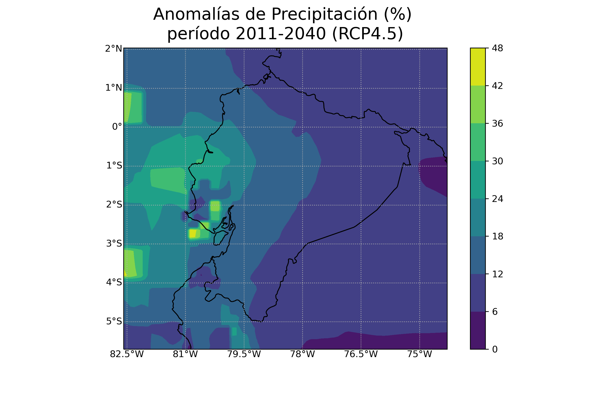
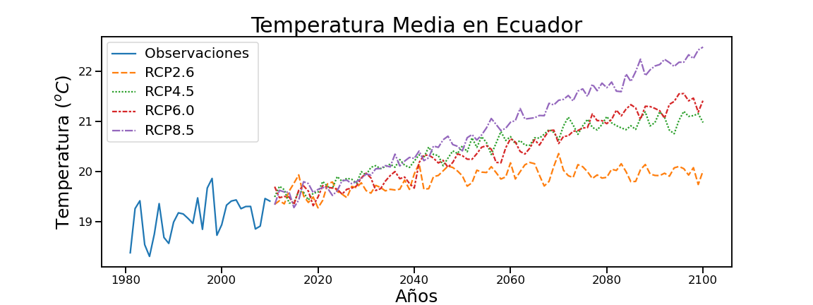

# Climate change projections for Ecuador

## Introduction

The goal of this project was to better understand climate change projections in Ecuador for the 21st century. To acomplish this goal, I ploted times series
and spatial maps of two climate variables (mean temperature and precipitation anomalies). The analyses comprised two periods (2011-2040 and 2041-2070) 
and two climate change scenarios (rcp 4.5 and rcp 8.5). 

## Data

ARMENTA, Guillermo (2016). Análisis de tendencias climáticas y evetnos climáticos extremos para Ecuador (reporte técnico).

## Table of Contents

| Directory  | Contents  |
|---|---|
|  figures | Nine figures. Eight griddded precipitation anomaly maps and one mean temperature time series plot|
| scripts  | Two script folders: data analysis and data vizualizations|

## Computing environment

* Python 3 (Anaconda installation). Libraries: glob, pandas, seaborn, matplotlib, xarray, numpy, cartopy, 
